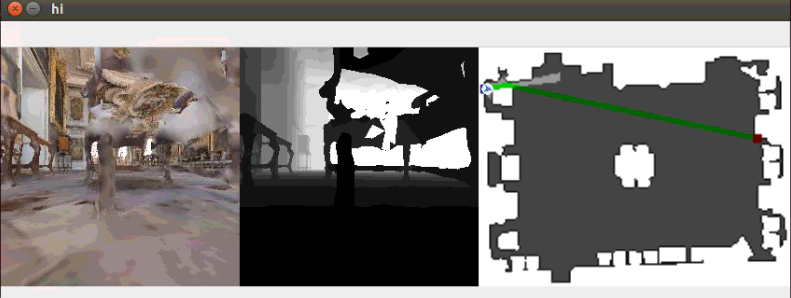

0. Requiremenst

   python 3.6 

   habitat-sim (https://github.com/facebookresearch/habitat-sim)

   habitat-api (https://github.com/facebookresearch/habitat-api)

   .. other python library, if any error occured about python library, just install it!

1. Edit data_path in vistargetnav_example.py

    ```python
    cfg.DATASET.DATA_PATH = '/path/to/habitat-api/data/datasets/pointnav/mp3d/v1/{split}/{split}.json.gz'
    cfg.DATASET.SCENES_DIR = '/path/to/habitat-api/data/scene_datasets'
    ```

2. Run vistargetnav_example.py

    ```
    ~$: python vistargetnav_example.py
    ```

3.  In this environment, the objective of each episode is finding a wood box 

    - Task : find a wood box in the environment
      - The location of the wood box changes every episode
      - If the agent collide with any obstacles, the episode ends.
    - Observation:
      - rgb : 256*256*3 RGB image
      - depth : depth image 0 ~ 10
    - Reward:
      - Living penalty : - 0.1
      - Success reward : 1.0

4. 

    To move the agent, press key

    - w : Move Forward

    - a : Turn Left

    - d : Turn Right
    - p : Pass the episode
    - q : Exit
